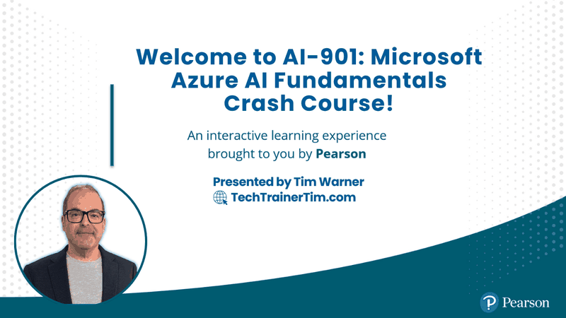

<!-- Cover Image -->
<p align="center">
  
</p>

<p align="center">
  <a href="https://TechTrainerTim.com"></a>
  <a href="https://www.youtube.com/c/TechTrainerTim"></a>
  <a href="https://opensource.org/licenses/MIT"></a>
  <a href="https://www.linkedin.com/in/timothywarner"></a>
  <a href="https://mvp.microsoft.com/en-US/mvp/profile/e9a13bca-2798-4247-be56-f116f780869d"></a>
  <a href="https://learn.microsoft.com/credentials/certifications/exams/ai-901/"></a>
</p>

# AI-901: Microsoft Azure AI Fundamentals

**Microsoft Press Video Course** | 16 lessons | 8 hours runtime | 30 minutes per lesson

A focused, exam-aligned video crash course that takes you from "what is generative AI" to "I just shipped a Foundry agent" in a single arc. Every lesson maps to a published AI-901 skill, and the build lessons run on a real Microsoft Foundry project, most using keyless Microsoft Entra authentication.

This repo is the source of truth for the recorded course:

1. [`lessons/`](lessons/) -- one folder per lesson with a README, runnable demo code under `demo/`, and supporting media under `assets/`.
2. [`docs/`](docs/) -- cross-lesson reference material, exam objective sync, and study resources.

## Course at a glance

The exam blueprint dated **April 15, 2026** (current at time of writing) defines two domains:

| Domain | Weight | What is measured |
| --- | --- | --- |
| 1 -- Identify AI concepts and capabilities | 40 -- 45% | Responsible AI principles, generative model components and configuration, AI workload identification across text, speech, vision, and information extraction. |
| 2 -- Implement AI solutions by using Microsoft Foundry | 55 -- 60% | Generative apps and agents, text and speech apps, computer vision and image-generation apps, information extraction with Azure Content Understanding. |

Authoritative source: [Microsoft Learn -- AI-901 study guide](https://learn.microsoft.com/credentials/certifications/resources/study-guides/ai-901). The official exam page lives at [learn.microsoft.com/credentials/certifications/exams/ai-901](https://learn.microsoft.com/credentials/certifications/exams/ai-901/). Pass score is **700**.

Exam reference: a verbatim local mirror of the skills-measured outline lives at
[`docs/ai901-objective-domain.md`](docs/ai901-objective-domain.md). The Cert Buddy agent uses this file as its
canonical objective list when generating practice items, labs, and study plans.

## Lesson plan

Every lesson is 30 minutes. Lessons 01 -- 07 are concept lessons that map to Domain 1; lessons 08 -- 16 are build lessons that map to Domain 2.

| # | Lesson | Domain | Skills measured |
| --- | --- | --- | --- |
| 01 | [Identify AI Workloads and Common Scenarios](lessons/lesson-01/README.md) | 1 | Identify scenarios for common AI workloads |
| 02 | [How Generative AI Models Work and How to Choose Them](lessons/lesson-02/README.md) | 1 | Generative AI model components and configurations |
| 03 | [Responsible AI: Fairness, Reliability and Safety, Privacy and Security](lessons/lesson-03/README.md) | 1 | Responsible AI principles 1 -- 3 |
| 04 | [Responsible AI: Inclusiveness, Transparency, Accountability](lessons/lesson-04/README.md) | 1 | Responsible AI principles 4 -- 6 |
| 05 | [Text Analysis and Speech Concepts](lessons/lesson-05/README.md) | 1 | Text analysis techniques; speech recognition and synthesis |
| 06 | [Computer Vision and Image-Generation Concepts](lessons/lesson-06/README.md) | 1 | Computer vision and image-generation models |
| 07 | [Information Extraction Concepts](lessons/lesson-07/README.md) | 1 | Techniques to extract information from text, images, audio, video |
| 08 | [Tour Microsoft Foundry and Deploy Your First Model](lessons/lesson-08/README.md) | 2 | Deploy a model and interact with it in the Foundry portal |
| 09 | [Craft Effective System and User Prompts](lessons/lesson-09/README.md) | 2 | Effective system and user prompts for generative AI models |
| 10 | [Build a Lightweight Chat Client Application with the Foundry SDK](lessons/lesson-10/README.md) | 2 | Lightweight chat client using the Foundry SDK |
| 11 | [Create and Test a Single-Agent Solution in the Foundry Portal](lessons/lesson-11/README.md) | 2 | Single-agent solution in the Foundry portal |
| 12 | [Build a Lightweight Client Application for an Agent](lessons/lesson-12/README.md) | 2 | Lightweight client application for an agent |
| 13 | [Build a Text Analysis Application with Foundry](lessons/lesson-13/README.md) | 2 | Lightweight application that includes text analysis |
| 14 | [Build a Speech-Enabled Application with Azure Speech in Foundry Tools](lessons/lesson-14/README.md) | 2 | Spoken prompts via multimodal model; Azure Speech in Foundry Tools |
| 15 | [Build a Computer Vision and Image-Generation Application](lessons/lesson-15/README.md) | 2 | Multimodal vision input; image-generation outputs |
| 16 | [Extract Information from Documents, Images, Audio, and Video with Content Understanding](lessons/lesson-16/README.md) | 2 | Azure Content Understanding across four modalities |

Full per-lesson learning objectives live in each `lessons/lesson-NN/README.md`.

## Audience

From the AI-901 audience profile: candidates are at the **beginning of an AI-solutions career**, with conceptual knowledge of AI in Azure, the foundational technical skills to work with it, basic Python coding syntax, and familiarity with Azure resources. This course is built around that profile -- no prior ML background assumed, but you should be comfortable opening a Python file and running a script.

## Prerequisites for the build lessons

Concept lessons 01 -- 03 require no setup. Concept lessons 04 -- 07 ship an optional SDK bookend sample and a one-command deploy script, so they share the build-lesson prerequisites below when you choose to run the code. Build lessons (08 -- 16) need:

- An **Azure subscription** with permission to create a Microsoft Foundry project.
- A **Microsoft Foundry project** with one chat-capable model deployed (a small, low-cost model is fine for the entire course).
- **Python 3.12** locally.
- The **Azure CLI** with `az login` completed. Most demos use `DefaultAzureCredential` (Microsoft Entra keyless authentication); a few early lessons read a key from `.env`. Either way, you will not check in secrets -- only `.env.example` is tracked.
- For lesson 14 specifically, an **Azure Speech** resource attached to your Foundry project.
- For lesson 16 specifically, **Azure Content Understanding** enabled in your Foundry project.

A single Foundry project is reused across all build lessons. Runnable sample inputs live in each lesson's `demo/samples/` folder (for example, Lesson 16's invoice, image, audio, and video files) so you do not need to source your own.

## Repository structure

```text
ai901/
├── README.md                    # This file
├── CLAUDE.md                    # Guidance for Claude Code agents
├── LICENSE                      # MIT
├── .markdownlint.json           # Markdown lint config
├── images/cover.png             # Course cover (800x450, optimized)
│
├── .github/                     # AI-901 Cert Buddy: agent + skills + prompts
│   ├── agents/
│   │   └── ai901-cert-buddy-agent.agent.md
│   ├── skills/
│   │   ├── ai901-item-creator/SKILL.md
│   │   ├── ai901-lab-creator/SKILL.md
│   │   └── ai901-study-planner/SKILL.md
│   ├── prompts/
│   │   ├── ai901-quiz.prompt.md
│   │   ├── ai901-lab.prompt.md
│   │   └── ai901-plan.prompt.md
│   ├── copilot-instructions.md
│   └── workflows/validate.yml
│
├── .vscode/                     # MCP server + recommended extensions
│   ├── mcp.json
│   └── extensions.json
│
├── lessons/                     # 16 lesson folders
│   ├── README.md                # Lessons index + domain map
│   └── lesson-NN/
│       ├── README.md            # Title, runtime, exam objectives, learning objectives, demo, resources
│       ├── demo/                # Runnable scripts, requirements.txt, .env.example, deploy script, optional webapp/ and samples/
│       └── assets/              # Slides, screenshots, sample inputs
├── docs/                        # Cross-lesson reference material
│   └── ai901-objective-domain.md  # Verbatim Microsoft Learn skills-measured sync
├── src/                         # Cross-lesson shared code (only when reused)
├── scripts/                     # Repo-level helpers
└── tests/                       # Cross-lesson tests
```

## Quick start

1. **Clone the repo:**

   ```powershell
   git clone https://github.com/timothywarner-org/ai901.git
   cd ai901
   ```

2. **Read the lessons index:** [`lessons/README.md`](lessons/README.md).
3. **For build lessons,** open the lesson folder, follow its `demo/README.md`, and run the code in `demo/`:

   ```powershell
   cd lessons/lesson-10/demo
   .\Deploy-Lesson10-Infrastructure.ps1       # provision the Azure resources (idempotent)
   python -m venv .venv
   .venv\Scripts\Activate.ps1
   pip install -r requirements.txt
   copy .env.example .env                      # then paste YOUR endpoint values
   az login                                    # keyless lessons authenticate as your az-login identity
   python lesson-10-foundry-chat-client.py
   ```

   Each lesson's `demo/README.md` lists the exact script name, the variables to set in `.env`, and a
   "Practice on your own" section. Never commit your `.env` -- only `.env.example` is tracked.

4. **Use the AI-901 Cert Buddy:** open the repo in VS Code with `code .`. The Microsoft Learn MCP server defined
   in [`.vscode/mcp.json`](.vscode/mcp.json) auto-loads, and the agent becomes available in GitHub Copilot Chat as
   `@ai901-cert-buddy-agent`. See the [AI-901 Cert Buddy](#ai-901-cert-buddy) section below.

## Companion Microsoft Learn resources

The AI-901 study guide names these as primary references. They are useful as second-pass reading after each video lesson:

- [Microsoft Foundry overview](https://learn.microsoft.com/azure/ai-foundry/)
- [Microsoft Foundry Agent Service](https://learn.microsoft.com/azure/ai-foundry/agents/overview)
- [Azure AI Language](https://learn.microsoft.com/azure/ai-services/language-service/overview)
- [Azure AI Speech](https://learn.microsoft.com/azure/ai-services/speech-service/overview)
- [Azure AI Vision](https://learn.microsoft.com/azure/ai-services/computer-vision/overview)
- [Azure Content Understanding](https://learn.microsoft.com/azure/ai-services/content-understanding/overview)
- [Microsoft Responsible AI](https://www.microsoft.com/ai/responsible-ai)

For broader documentation, ask a question on [Microsoft Q&A](https://learn.microsoft.com/answers/) or visit the [AI and Machine Learning community hub](https://techcommunity.microsoft.com/t5/artificial-intelligence-and/ct-p/AI).

## AI-901 Cert Buddy

An AI-powered study companion for the **Microsoft AI-901: Microsoft Azure AI Fundamentals** certification, built
entirely on GitHub Copilot agents. The buddy lives in [`.github/`](.github/) as agent definitions, skill specs, prompt
templates, and an MCP server configuration that turns GitHub Copilot Chat into an interactive exam coach for this
workspace.

The agent generates **exam-realistic practice questions** with two-phase interactive evaluation, **short hands-on labs**
(15-25 minutes) across Microsoft Foundry portal builds, Foundry SDK client apps, Azure AI services, and Azure Content
Understanding, and **personalized study plans** based on your self-assessed confidence across the two AI-901 domains.
All content is original and grounded in Microsoft Learn via MCP.

### Cert Buddy prerequisites

| Requirement | Purpose |
| --- | --- |
| **VS Code** | IDE with Copilot Chat support |
| **GitHub Copilot Chat extension** | Runs the agent and skills inside VS Code |
| **Azure subscription** (optional) | Only required for build-lesson labs that create Microsoft Foundry, Azure AI services, or Azure Content Understanding resources |

No API keys, Node.js, or Python are required for the Cert Buddy itself. The Microsoft Learn MCP server is a free hosted
service with no sign-up.

### Cert Buddy quick start

1. Open the folder in VS Code:

   ```bash
   code ai901
   ```

2. The Microsoft Learn MCP server is defined in [`.vscode/mcp.json`](.vscode/mcp.json) and auto-configures when the
   workspace loads.

3. Open **GitHub Copilot Chat** and invoke the agent:

   ```text
   @ai901-cert-buddy-agent Quiz me on Microsoft Foundry agent deployment
   ```

   Or use the slash commands. Type `/` in Copilot Chat:

   ```text
   /ai901-quiz
   /ai901-lab
   /ai901-plan
   ```

### Cert Buddy skills

| Skill | File | What it does |
| --- | --- | --- |
| `ai901-item-creator` | [`.github/skills/ai901-item-creator/SKILL.md`](.github/skills/ai901-item-creator/SKILL.md) | Exam-realistic AI-901 practice questions with two-phase interactive delivery (question -> wait -> evaluate). |
| `ai901-lab-creator` | [`.github/skills/ai901-lab-creator/SKILL.md`](.github/skills/ai901-lab-creator/SKILL.md) | 15-25 minute self-validating labs across Microsoft Foundry portal, Foundry SDK for Python, Azure AI services, and Azure Content Understanding. |
| `ai901-study-planner` | [`.github/skills/ai901-study-planner/SKILL.md`](.github/skills/ai901-study-planner/SKILL.md) | Personalized study plans based on confidence across the two AI-901 domains, with real Microsoft Learn module links and lesson cross-references. |

### Cert Buddy MCP server

| Server ID | Technology | Purpose |
| --- | --- | --- |
| `ai901buddy-mslearn` | `https://learn.microsoft.com/api/mcp` (HTTP) | Free Microsoft Learn MCP server -- no API keys, no sign-up. Provides `microsoft_docs_search`, `microsoft_docs_fetch`, and `microsoft_code_sample_search`. Grounds all Cert Buddy content in official Microsoft documentation. |

### Cert Buddy key rules

- **Grounded in Microsoft Learn.** Every question and lab is grounded in official Learn docs via MCP before any other
  source.
- **Current terminology only.** Legacy names like *Azure AI Studio*, *Azure AI Foundry*, *Azure AD*, *Azure Cognitive
  Services*, *Form Recognizer*, and *LUIS* are silently replaced with *Microsoft Foundry*, *Microsoft Entra ID*, *Azure
  AI services*, *Azure AI Document Intelligence*, and *Azure AI Language CLU*. See the full rename table in
  [`.github/copilot-instructions.md`](.github/copilot-instructions.md).
- **Original content only.** The agent never recreates, paraphrases, or references real exam questions, braindumps, or
  leaked content.
- **No contractions. No trick wording. Distractors must be real.**
- **Answer randomization.** The correct answer position is distributed across A, B, C, and D.
- **Company randomization.** Scenarios draw from the WWL-approved Fictitious Names List embedded directly in the agent
  and skill files -- always the entire company name, never a shortened form.
- **Labs include cleanup.** Every lab ends with exact rollback or deletion steps so that no Azure resources linger.
- **Microsoft style.** Items follow the Microsoft Worldwide Learning Exam Writing Style Guide; prose follows the
  Microsoft Writing Style Guide. Both rule sets are inlined into the agent and skill files.

## Authoring conventions

This repo follows the same writing rules as Tim's other Microsoft cert courses:

- Current Microsoft product names only -- *Microsoft Foundry*, not *Azure AI Foundry* or *Azure AI Studio*.
- Plain ASCII -- use `--` for em dashes and `->` for arrows.
- No contractions in instructional content -- write *do not*, not *don't*.
- Markdown lint enforced via `.markdownlint.json`. Validate with `npx markdownlint-cli2 "**/*.md"`.
- Exam objective primacy: when content drifts from the published AI-901 skills measured, the published skills win. See [`CLAUDE.md`](CLAUDE.md) for the full source-of-truth hierarchy.

## Instructor

**Tim Warner** -- Microsoft MVP (Azure AI and Cloud and Datacenter Management), Microsoft Certified Trainer.

- [LinkedIn](https://www.linkedin.com/in/timothywarner/)
- [Website](https://techtrainertim.com/)
- [Microsoft Press author page](https://www.microsoftpressstore.com/authors/bio/2bb8e35a-b8dd-4b65-9a8d-3f0b73af6f10)
- [O'Reilly author page](https://learning.oreilly.com/search/?query=Tim%20Warner)

## Disclaimer

This is an **unofficial** study companion. Always verify exam scope and policy against the [official Microsoft AI-901 exam page](https://learn.microsoft.com/credentials/certifications/exams/ai-901/) and the [AI-901 study guide](https://learn.microsoft.com/credentials/certifications/resources/study-guides/ai-901).

## License

MIT License. See [`LICENSE`](./LICENSE) for details.
